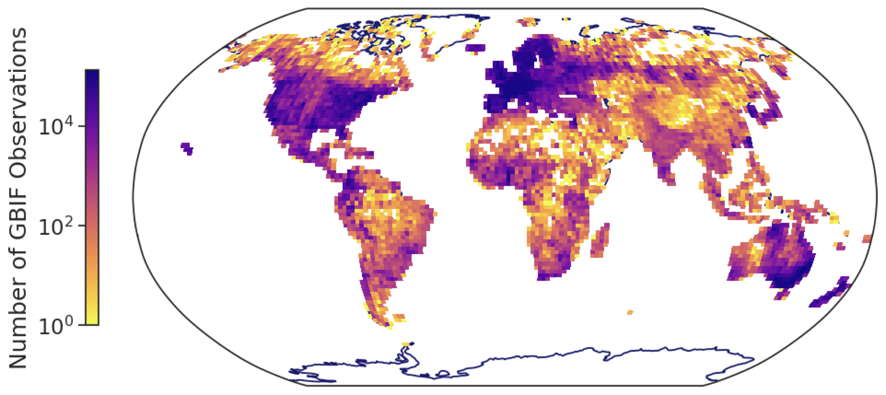
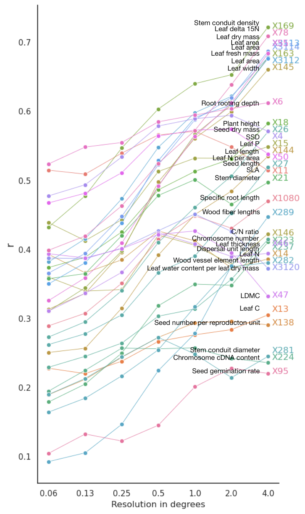

# Trait maps based on sample of GBIF database

## Trait maps

Here you will find trait maps based on GBIF data and traits found in the TRY gap-filled dataset in GeoTIFF format at a 0.2°, 0.5°, and 2° resolutions. Each folder also contains the sPlotOpen-based maps for all respective traits and resolutions.

The folder *traitmaps* contains .grd files for each trait (see list below) with multiple layers: **observation count, mean, median, standard deviation, 05% quantile, 95% quantile**. These can be loaded as a brick of layers in R as follows:

```
library(raster)

test <- brick("file.grd")
plot(test)
```

The subfolders in the *traitmaps* directory are organized as follows:
* The first subfolder classifies the plant functional types integrated with
	* *Shrub_Tree_Grass* including species of all plant functional types.
	* *Shrub_Tree* including shrub and tree species.
	* *Grass* for grassland species only.
* Each of these subolders contains subfolders for map products at 0.2, 0.5 and 2.0 degrees (longitude, latitude)

## Data

Source of species observations are GBIF sampled as such:
  1. GBIF download: https://doi.org/10.15468/dl.fe2kv3
Creation Date: 16:44:41 2 June 2023
Records included: 257357303 records from 6840 published datasets 
Compressed data size: 29.6 GB
Download format: simple tab-separated values (TSV)
Filter used:
{
  "and" : [
    "BasisOfRecord is one of (Observation, Human Observation, Occurrence evidence)",
    "DistanceFromCentroidInMeters is greater than or equal to 1500.0",
    "HasCoordinate is true",
    "HasGeospatialIssue is false",
    "IsInCluster is false",
    "OccurrenceStatus is Present",
    "TaxonKey is Tracheophyta",
    "Year 1900-2023"
  ]
}

  2. The observations were then linked to the TRY gap-filled dataset, which resulted in a total of n= observations. 90% of the GBIF observations were matched, 70% of species in TRY, and 24% of species in GBIF (numbers based for map products using all plant functional types).
  3. Matched observations were then binned into equal area hexagons (using the package size hex9, which corresponds to about 0.5 degrees at equator)
  4. From each hexagon were then sampled 10,000 observations. If a hexagon contained less than 10,000 observations, all observations were kept.
  5. This GBIF subsample contained approx. 35,000,000 observations



Figure 1: Global density of GBIF subsample at 2° resolution.

## Traits in TRY gap-filled:
| TRY trait ID | Trait name |
|--------------|------------|
| 4            | Stem specific density (SSD) or wood density (stem dry mass per stem fresh volume) |
| 6            | Root rooting depth |
| 11           | Leaf area per leaf dry mass (specific leaf area, SLA or 1/LMA) |
| 13           | Leaf carbon (C) content per leaf dry mass |
| 14           | Leaf nitrogen (N) content per leaf dry mass |
| 15           | Leaf phosphorus (P) content per leaf dry mass |
| 18           | Plant height |
| 21           | Stem diameter |
| 26           | Seed dry mass |
| 27           | Seed length |
| 46           | Leaf thickness |
| 47           | Leaf dry mass per leaf fresh mass (leaf dry matter content, LDMC) |
| 50           | Leaf nitrogen (N) content per leaf area |
| 55           | Leaf dry mass (single leaf) |
| 78           | Leaf nitrogen (N) isotope signature (delta 15N) |
| 95           | Seed germination rate (germination efficiency) |
| 138          | Seed number per reproduction unit |
| 144          | Leaf length |
| 145          | Leaf width |
| 146          | Leaf carbon/nitrogen (C/N) ratio |
| 163          | Leaf fresh mass |
| 169          | Stem conduit density (vessels and tracheids) |
| 223          | Species genotype: chromosome number |
| 224          | Species genotype: chromosome cDNA content |
| 237          | Dispersal unit length |
| 281          | Stem conduit diameter (vessels, tracheids) |
| 282          | Wood vessel element length; stem conduit (vessel and tracheids) element length |
| 289          | Wood fiber lengths |
| 1080         | Root length per root dry mass (specific root length, SRL) |
| 3112         | Leaf area (in case of compound leaves: leaf, undefined if petiole in- or excluded) |
| 3113         | Leaf area (in case of compound leaves: leaflet, undefined if petiole is in- or excluded) |
| 3114         | Leaf area (in case of compound leaves: undefined if leaf or leaflet, undefined if petiole is in- or excluded) |
| 3120         | Leaf water content per leaf dry mass (not saturated) |


## Correlation of sPlotOpen and GBIF sample for all traits at different resolutions

The correlations (based on all plant functional types) between sPlotOpen and GBIF-based maps were calculated as in Wolf et al. 2022.

