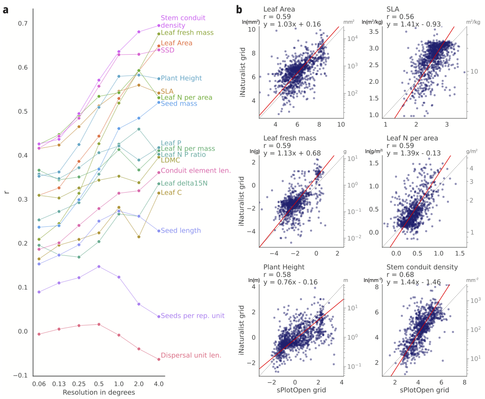

# Trait maps based on iNaturalist "research-grade" observations

## Trait maps

## Correlation of sPlotOpen and iNat maps for all traits at different resolutions

*Figure 1*: published trait correlations - see https://doi.org/10.1038/s41559-022-01904-x

**Figure 2**: for DGVM relevant variables
